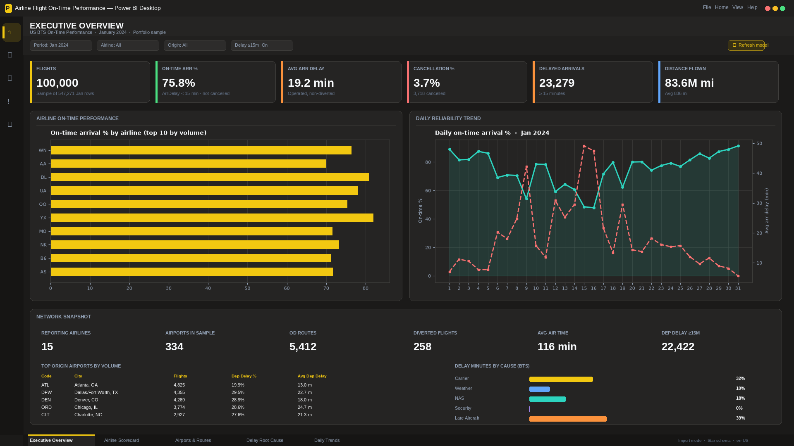
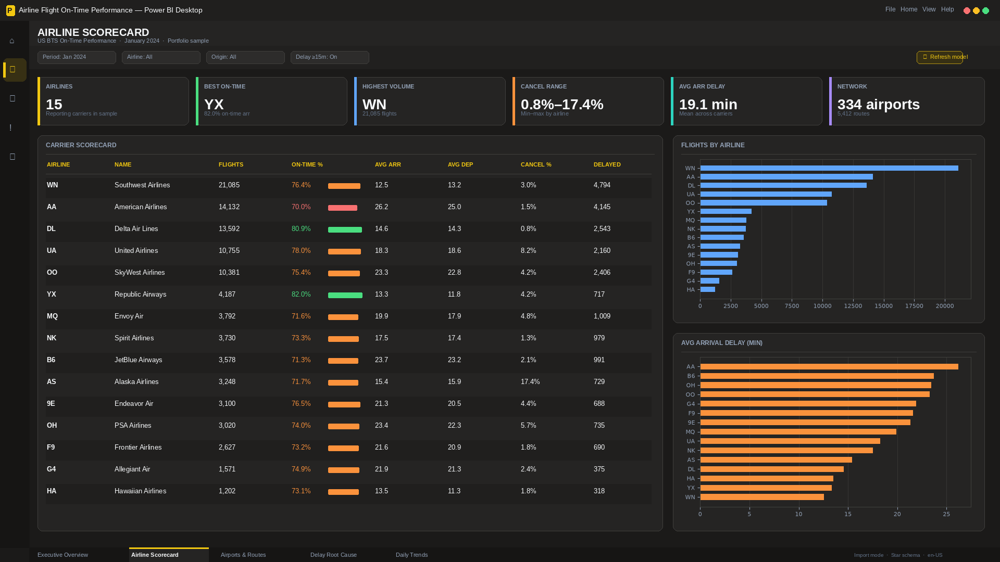
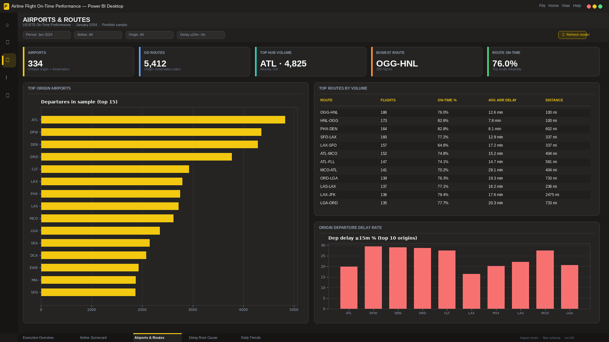
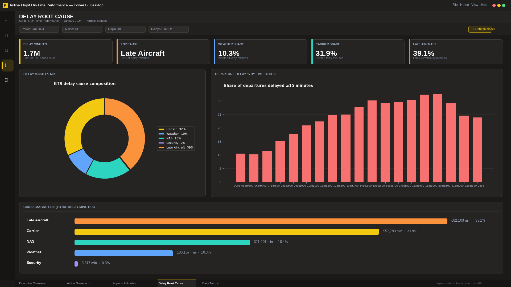
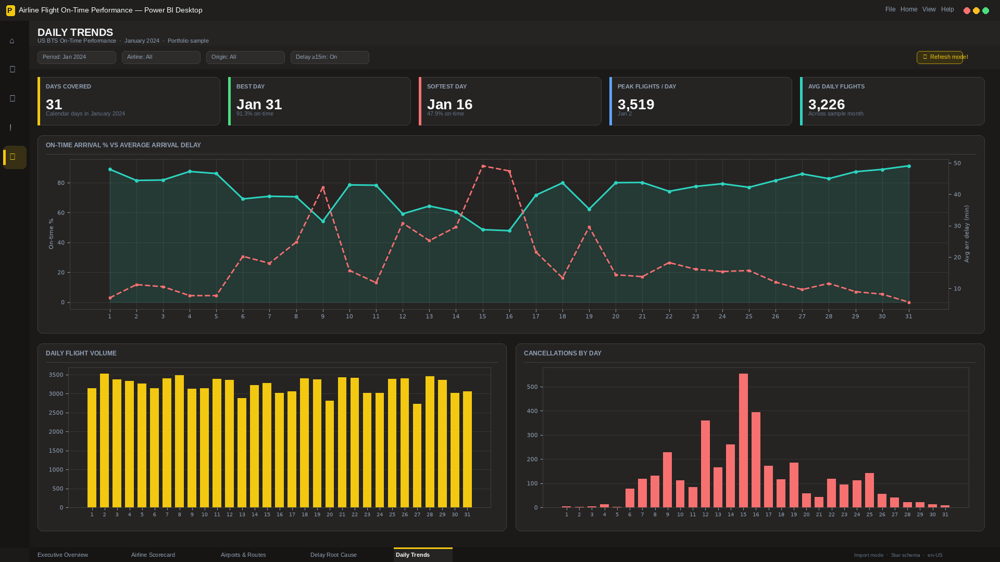

# Airline Flight On-Time Performance Dashboard

Analysis of US airline on-time performance for January 2024 (BTS). Flights, delays, cancellations, hubs, and routes are reviewed together so ops and planning teams can see where reliability is slipping and what to investigate first.

**Walkthrough:** [`artifacts/airline-flight-dashboard-demo.mp4`](./artifacts/airline-flight-dashboard-demo.mp4)

---

## Business Problem

Airline and network leaders need fast answers on on-time arrivals, cancellations, and delay drivers across carriers and airports. Raw BTS extracts are large and hard to compare side by side.

Without a consolidated view it is difficult to:

- Benchmark airlines on reliability and delay
- Spot high-delay hubs and routes
- Separate delay causes (carrier, weather, NAS, late aircraft, security)
- Monitor day-to-day swings in on-time performance

---

## Dashboard Overview

A five-page interactive dashboard for network reliability review. Decision-makers can move from portfolio KPIs to airline scorecards, airports/routes, delay root cause, and daily trends in one place.

Period covered: **January 2024** · **100,000** flights (stratified sample of 547,271 reporting-carrier rows)

---

## Key Metrics

| KPI | Value |
|---|---|
| Flights | **100,000** |
| On-Time Arrival % | **75.8%** |
| Average Arrival Delay | **19.2 min** |
| Cancellation Rate | **3.7%** (3,718 flights) |
| Delayed Flights (arr ≥15 min) | **23,279** |
| Distance Flown | **83.6M mi** |
| Top Delay Cause | Late aircraft (**39%** of delay minutes) |

---

## Dashboard Pages

### Executive Overview



- Sample shows **100,000** flights with **75.8%** on-time arrivals and **19.2 min** average arrival delay.
- Cancellation rate is **3.7%** (**3,718** flights); **23,279** arrivals delayed ≥15 min.
- Daily reliability dips mid-month (around Jan **13–17**), when on-time % falls toward ~**50%**.
- Delay minutes are led by **late aircraft (39%)**, then **carrier (32%)**, **NAS (18%)**, and **weather (10%)**.

### Airline Scorecard



- **15** reporting carriers; best on-time is **YX – Republic Airways (82.0%)**; highest volume is **WN – Southwest (21,085 flights)**.
- **DL – Delta** combines strong on-time (**80.9%**) with the lowest cancellation rate (**0.8%**).
- **AA – American** underperforms (**70.0%** on-time) with the highest average arrival delay (**26.2 min**).
- **AS – Alaska** sits at the high end of cancellations (**17.4%**), flagging carrier-specific disruption risk.

### Airports & Routes



- Network covers **334** airports and **5,412** OD routes; top hub by volume is **ATL (4,825)**.
- Among high-volume routes, **PHX–DEN** is relatively strong (**82.9%** on-time); **LAX–SFO** is weaker (**64.6%**).
- Departure delay ≥15m rates near **~30%** at **DEN, ORD, and CLT**; **ATL** stays near ~**20%** despite leading volume.

### Delay Root Cause



- About **1.7M** delay minutes in the sample; top cause is **late aircraft (39.1% / 682,103 min)**.
- **Carrier** is second (**31.9%**), then **NAS (18.4%)**, **weather (10.3%)**, and **security (0.3%)**.
- Departure delay share rises through the day, peaking above **30%** in the **19:00–21:59** blocks.
- Late aircraft + carrier explain roughly **70%** of delay minutes — turnaround and schedule buffering matter more than weather-only narratives.

### Daily Trends



- Coverage spans **31** days; average **~3,226** flights/day with peak **3,519** on Jan **2**.
- Best day: **Jan 31 (91.3% on-time)**; softest day: **Jan 16 (47.9% on-time)**.
- Daily volume stays relatively stable (~3,000–3,500), so the mid-month reliability drop is not a volume surge.
- Cancellations spike around Jan **10–16** (peaking above **~500**/day), aligning with the worst on-time window.

---

## Key Findings

1. Network baseline is about **76%** on-time with **~19 min** average arrival delay and **3.7%** cancellations.
2. Carrier gaps are large — Republic and Delta lead; American lags on delay; Alaska shows elevated cancellations.
3. Hub risk concentrates at DEN / ORD / CLT (~**30%** dep-delay rates); LAX–SFO is among the weaker busy routes.
4. Controllable and cascading factors (late aircraft + carrier) dominate delay minutes.
5. Mid-month (Jan **15–16**) is the softest window; Jan **31** is the strongest day.

---

## Analysis Process

- Collected and cleaned the BTS on-time extract sample.
- Validated on-time, delay, and cancellation definitions.
- Performed exploratory analysis by carrier, airport, and day.
- Investigated delay-cause mix and time-of-day patterns.
- Calculated business metrics used in the dashboard.
- Built dashboard pages to highlight reliability bottlenecks.

---

## Tools Used

- Power BI
- SQL
- Python
- Excel

---

## Repository Structure

```text
data/          cleaned tables (csv / xlsx / parquet)
excel/         dictionary, cleaning log, summary
sql/           KPI and quality queries
python/        EDA / cleaning / feature scripts
dashboard/     Power BI project (.pbip)
screenshots/   dashboard page images
artifacts/     walkthrough video
```

---

## How to View

1. Open `dashboard/Airline-Flight-Dashboard.pbip` in Power BI Desktop
2. See [`screenshots/`](./screenshots/)
3. Watch [`artifacts/airline-flight-dashboard-demo.mp4`](./artifacts/airline-flight-dashboard-demo.mp4)

---

## Author

Nishant Tyagi
